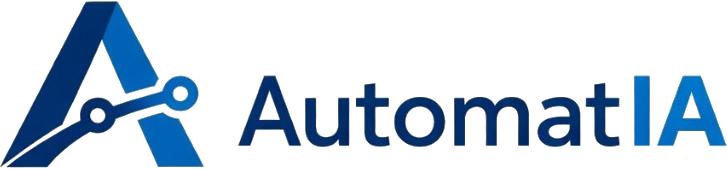

<p align="center">
  
</p>

<h3 align="center">Software que trabalha enquanto você dorme.</h3>

<p align="center">
  Landing page institucional da AutomatIA — aplicações escaláveis, automações com IA
  e sistemas sob medida.
</p>

<p align="center">
  
  
  
  
  
</p>

---

## Sobre

Site institucional de uma página (one-pager) construído para converter visitantes em
leads: hero com números animados, grade de serviços, comparativo antes/depois,
simulação de chat com um agente de IA, método de trabalho em 4 etapas e CTA de contato.

Todo o texto do site vive num único arquivo (`src/content/site.ts`), então trocar copy
não exige mexer em componente nenhum.

## Stack

| Camada        | Tecnologia                                     |
| ------------- | ----------------------------------------------- |
| Framework     | [Next.js](https://nextjs.org) (App Router)      |
| Linguagem     | TypeScript                                      |
| Estilo        | Tailwind CSS                                    |
| Animação      | [GSAP](https://gsap.com) (ScrollTrigger) + [Framer Motion](https://www.framer.com/motion/) |
| Componentes   | Estrutura no padrão [shadcn/ui](https://ui.shadcn.com) (`components.json`, `src/components/ui`) |
| Ícones        | [lucide-react](https://lucide.dev)              |

## Funcionalidades

- **Navbar em dock flutuante** — barra fixa no topo que se comporta como um dock
  (efeito de magnificação no hover), construída sobre `src/components/ui/dock.tsx`.
- **Menu cinético em tela cheia** — overlay full-screen animado com GSAP, com
  formas geométricas reagindo ao hover de cada link.
- **Reveal on scroll** — wrapper `<Reveal>` e hook `useReveal` padronizam as
  animações de entrada de cada seção via ScrollTrigger.
- **Contadores animados** — números da seção de hero contam até o valor final
  quando entram em viewport.
- **Simulação de chat** — demonstra o atendimento do agente de IA em tempo real.
- Respeita `prefers-reduced-motion` (desliga as animações para quem pediu menos movimento).

## Como rodar

Pré-requisitos: Node.js 18+ e npm.

```bash
npm install
npm run dev      # http://localhost:3000
```

```bash
npm run build     # build de produção
npm start         # serve o build
npm run lint      # lint
```

Deploy recomendado: [Vercel](https://vercel.com) — importe o repositório, sem
configuração extra.

## Estrutura do projeto

```
src/
  app/
    layout.tsx        fontes (Archivo + IBM Plex Mono), metadata/SEO
    page.tsx           composição das seções, nesta ordem
    globals.css         reset, .kicker e .shell
  content/
    site.ts             TODO O CONTEÚDO EM TEXTO — comece aqui
  components/
    ui/
      dock.tsx           primitivo de dock flutuante (shadcn-style)
    Navbar.tsx           navbar em dock flutuante
    MenuOverlay.tsx       menu cinético em tela cheia
    Hero.tsx              hero + barra de números
    Servicos.tsx            grade de 9 serviços
    AntesDepois.tsx          comparativo em duas colunas
    Agentes.tsx               seção azul + simulação de chat
    Metodo.tsx                 as 4 etapas
    Case.tsx                    depoimento (placeholder)
    CTA.tsx                      bloco de contato
    Footer.tsx
    Reveal.tsx                    wrapper de animação de entrada
    Counter.tsx                    número que conta ao aparecer
  hooks/
    useReveal.ts          hook de reveal com ScrollTrigger
  lib/
    gsap.ts                registro do plugin + helpers
    utils.ts                 helper `cn` (clsx + tailwind-merge)
```

## Trocar textos

Tudo em `src/content/site.ts`. Nenhum componente tem copy embutida.

## Animações

O padrão é `<Reveal>`:

```tsx
<Reveal className="flex flex-col gap-5">conteúdo</Reveal>
<Reveal y={60} delay={0.16}>entra mais tarde</Reveal>
<Reveal x={-60} y={0}>entra pela esquerda</Reveal>
```

Para animar um elemento já existente, use o hook direto:

```tsx
const ref = useReveal<HTMLDivElement>({ y: 80, duration: 1 });
return <div ref={ref}>…</div>;
```

Detalhe importante em `lib/gsap.ts`: elementos já visíveis no carregamento animam
na hora e só o que está abaixo da dobra recebe gatilho de scroll. Sem isso o
ScrollTrigger dispara tudo de uma vez antes do layout assentar e a página aparece
sem animação. `prefers-reduced-motion` desliga todo o movimento.

## Paleta de cores

Definida em `tailwind.config.ts`:

| Nome     | Hex       |         |
| -------- | --------- | ------- |
| navy     | `#0b2a5b` | ██ |
| brand    | `#1a73c8` | ██ |
| sky      | `#6fabe8` | ██ |
| ground   | `#f3f2f2` | ██ |
| surface  | `#eae9e9` | ██ |
| ink      | `#201e1d` | ██ |

Sem raio de borda em nenhum lugar (exceto o dock da navbar), réguas de 2px.

## Pendências antes de publicar

- `caseCliente` em `site.ts`: citação, autor e imagem são placeholders. Coloque a
  imagem em `public/` e aponte `imagem: "/case-01.jpg"`.
- Revisar as promessas "2 semanas até o 1º entregável" e "carrega em menos de 1s".
- Trocar `contato.instagram` pelo perfil real.

## Licença

Projeto proprietário — todos os direitos reservados à AutomatIA.
